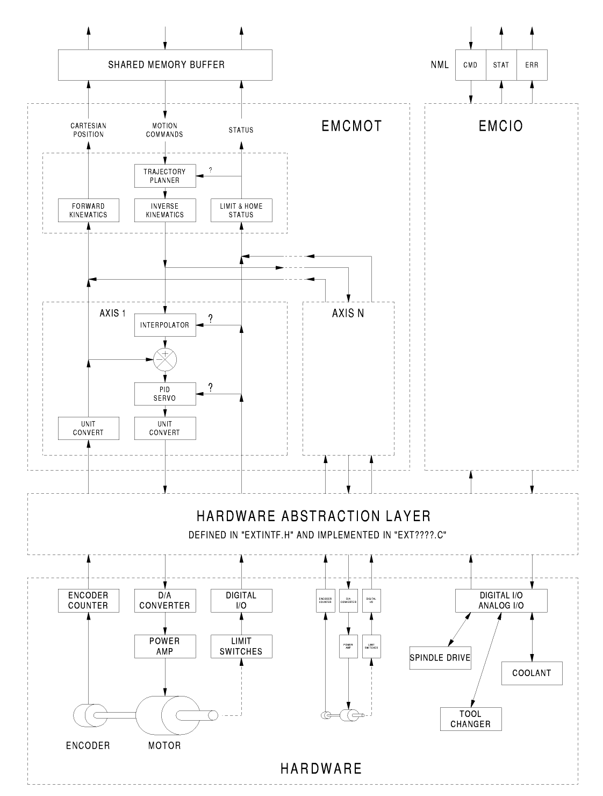
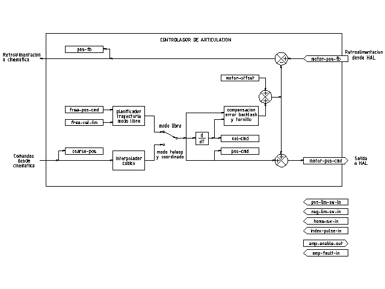

:lang: es
:toc:

[[cha:code-notes]]
= Notas sobre el código

// Resaltado de idioma personalizado
// debe venir después del título del documento para solucionar un error en asciidoc 8.6.6
:ini: {basebackend@docbook:'':ini}
:hal: {basebackend@docbook:'':hal}
:ngc: {basebackend@docbook:'':ngc}

== Público al que va dirigido

Este documento es una colección de notas sobre los aspectos internos de LinuxCNC.
Es principalmente de interés para los desarrolladores, pero gran parte de la información
también puede ser de interés para integradores de sistemas y otras personas que tengan
curiosidad por saber cómo funciona LinuxCNC. Gran parte de esta información está ahora
obsoleta y nunca se ha revisado su precisión. Intentaremos arreglarlo.

== Organización

Habrá un capítulo para cada uno de los componentes principales de LinuxCNC.
Otros capítulos explican cómo funcionan juntos. Este documento es
un trabajo en progreso y su diseño puede cambiar en el futuro.

== Términos y definiciones

* 'AXIS' - Un 'EJE' es uno de los nueve grados de libertad que definen la
  posición de una herramienta en el espacio cartesiano tridimensional.
  Esos nueve ejes se denomin X, Y, Z, A, B, C, U, V y W.
  Las coordenadas lineales ortogonales X, Y y Z determinan dónde está
  posicionada la punta de la herramienta.
  Las coordenadas angulares A, B y C determinan la orientación de la herramienta.
  Un segundo conjunto de coordenadas ortogonales lineales U, V y W
  permite el movimiento de la herramienta (normalmente para acciones de corte) en relación con ejes previamente desplazados y rotados.
  Desafortunadamente "eje" también es
  A veces se utiliza para significar un grado de libertad de la propia máquina.
  En una maquina tradicional, esto no causa confusión, ya que el movimiento de la mesa corresponde directamente al movimiento a lo largo del eje X o Y. Sin embargo, las
  articulaciones del hombro y del codo de un brazo robótico o los actuadores lineales de un hexápodo no corresponden al movimiento a lo largo de ningún eje cartesiano, y en
  general es importante hacer la distinción entre ejes cartesianos
  y los grados de libertad de la máquina. En este documento, estos últimos
  se llamarán "articulaciones" o 'joints', no ejes. Las GUI y algunas otras partes del código no siempre siguen esta distinción, pero los elementos internos del controlador de movimiento si lo hace.

* 'JOINT' - Una 'ARTICUACIÓN' es una de las partes móviles de la máquina.
  Las articulaciones son distintas de los ejes, aunque a veces ambos términos se usan (mal) para significan lo mismo. En LinuxCNC, una articulación es una cosa física que se puede mover, no una coordenada en el espacio. Por ejemplo, el hombro, el codo y las muñecas de un brazo robótico son articulaciones, al igual que los actuadores lineales de un Hexápodo. Cada articulación tiene un motor o actuador de algún tipo asociado con él. Las articulaciones no necesariamente corresponden a los ejes X, Y y Z, aunque para máquinas con cinemática trivial este puede ser el caso.
  Incluso en esas máquinas, la posición de la articulación y la posición del eje son son cosas fundamentalmente diferentes. En este documento, los términos 'articulación' y 'eje' se utilizan con cuidado para respetar sus significados distintos.
  Lamentablemente, las GUI para máquinas con cinemática trivial pueden pasar por alto u ocultar por completo la distinción entre articulaciones y ejes. Además, los archivo INI (que configuran maquinas reales) utiliza el término 'axis' para los datos que se representarían con mayor precisión como datos 'joint', como escala de entrada y salida, etc.

[NOTA]
Esta distinción se hizo en la versión 2.8 de LinuxCNC.
El archivo INI tuvo una nueva sección [JOINT_<num>]. Muchos de los parámetros que estaban previamente en las secciones [AXIS_<letra>] ahora están en la nueva sección.
Otras secciones, como [KINS], también adoptan nuevos parámetros para que coincidan con esto.
Se proporciona un script de actualización para transformar los archivos INI antiguos a la nueva configuración de ejes/articulaciones.

* 'POSE' - Una pose es una posición completamente especificada en el
  espacio cartesiano 3D.
  Cuando nos referimos a una pose en el controlador de movimiento LinuxCNC nos referimos a una estructura EmcPose, que contiene seis coordenadas lineales (X, Y, Z, U, V y W) y tres angulares (A, B y C).

* 'coord' - o modo coordinado, significa que todas las articulaciones
  están sincronizadas y se mueven juntas según las instrucciones del código de nivel superior. Es el modo normal durante el mecanizado.
  En el modo coordinado, se supone que los comandos se dan en el marco de referencia cartesiano, y si la máquina no es cartesiana, los comandos son traducidos por la cinemática para accionar cada articulación en el espacio articular según sea necesario.

* 'free' - 'libre' significa que los comandos se interpretan en el
  espacio de articulaciones.
  Se utiliza para mover manualmente (jogging) articulaciones individuales.
  El 'homing' también se realiza en modo libre; de hecho, máquinas con cinemática no trivial deben estar en Home antes de poder pasar al modo coordinado o al modo de teleoperación.

* 'teleop' es el modo que se necesita si estás moviendo manualmente
  (jogging) un hexápodo.
  Los comandos de jog implementados por el controlador de movimiento son jogs articulare, que trabajan en modo libre. Pero si quieres mover un hexápodo o una máquina similar a lo largo de un eje cartesiano en particular, se deben operar más de una articulaciones.
  Para eso está el término 'teleop'.

== Descripción general de la arquitectura de LinuxCNC

Hay cuatro componentes contenidos en la arquitectura LinuxCNC: 
un controlador de movimiento (EMCMOT), un controlador de E/S discreto (EMCIO), un ejecutor de tareas que los coordina (EMCTASK) y varias Interfaces de usuario en modo texto o gráfico.
Cada una de ellas se describirá en el presente
documento, tanto desde el punto de vista del diseño como desde el de los desarrolladores (dónde encontrar los datos necesarios, cómo ampliar/modificar fácilmente cosas, etc.).

imagen::LinuxCNC-block-diagram-small_es.png[align="center"]

=== Arquitectura del software LinuxCNC

En el nivel más básico, LinuxCNC es una
jerarquía de tres controladores: el controlador de comandos de nivel de tarea y el programa intérprete, el controlador de movimiento y el controlador de E/S discreta.
El controlador de E/S discreta se implementa como una jerarquía de controladores, en este caso, para husillo, refrigerante y subsistemas auxiliares (parada de emergencia, lubricación, etc.).
El controlador de tareas coordina las acciones de los controladores de movimiento y de E/S discretas. Sus acciones están programadas en forma convencional por programas de control numérico en "código G y M", que son interpretados por el controlador de tareas en mensajes NML y enviados a los controladores de movimiento o de E/S discretos en los momentos apropiados.

== Introducción al controlador de movimiento

El controlador de movimiento es un componente en tiempo real. Recibe comandos de control de movimiento de las partes no en tiempo real de LinuxCNC (intérprete de código G/Task, GUIs, etc.) y ejecuta esos comandos dentro de su contexto en tiempo real. La comunicación del contexto no en tiempo real al contexto en tiempo real se produce a través de un mecanismo de paso de mensajes IPC que utiliza memoria compartida y a través de la capa de abstracción de hardware (HAL).

El estado del controlador de movimiento se pone a disposición del resto de LinuxCNC a través de la misma memoria compartida de paso de mensajes IPC y a través de HAL.

El controlador de movimiento interactúa con los controladores de motor y otro hardware, en tiempo real y en no tiempo real, mediante HAL.

Este documento utiliza términos como pines HAL, señales HAL, etc., sin
explicándolos. Para obtener más información sobre el HAL, consulte el
Manual de HAL. Otro capítulo de este documento se dedicará al interior del propio HAL, pero en este
Capítulo, solo utilizamos la API HAL tal como se define en src/hal/hal.h.

=== Módulos Motion Controller

Las funciones en tiempo real del controlador de movimiento se implementan con módulos en tiempo real: objetos compartidos de espacio de usuario para sistemas Preempt-RT o módulos del kernel para algunas implementaciones en tiempo real en modo kernel como RTAI:

* 'tpmod' - planificación de trayectoria
* 'homemod' - funciones homing
* 'motmod' - procesa comandos NML y controla el hardware a través de HAL
* 'módulo cinemático': realiza cálculos cinemáticos directos (articulaciones->coordenadas) e inversos (coordenadas->articulaciones)

LinuxCNC se inicia mediante un script *linuxcnc* que lee un
archivo INI de configuración e inicia todos los procesos necesarios.
Para control de movimiento en tiempo real, el script primero carga el  
los módulos tpmod y homemod predeterminados y luego carga los módulos de cinemática y movimiento según la configuración en halfiles especificados por el archivo INI.

Se pueden utilizar módulos de planificación de trayectoria o de homing personalizados (creados por el usuario) en lugar de los módulos predeterminados a través de la configuración del archivo INI
o las opciones de línea de comandos. Los módulos personalizados deben implementar todas funciones utilizadas por los módulos predeterminados. La utilidad halcompile se puede utilizar para crear un módulo personalizado.

== Diagramas de bloques y flujo de datos

La siguiente figura es un diagrama de bloques de un controlador de articulaciones. Hay uno por cada articulación.
Los controladores de articulaciones funcionan a un nivel inferior al de la cinemática, donde todas las articulaciones son completamente independientes. Todos los datos de una articulación
está en una estructura de articulación única. Algunos miembros de esa estructura son visibles en el diagrama de bloques, como coarse_pos, pos_cmd y motor_pos_fb.

.Diagrama de bloques de controlador de articulación

La figura anterior muestra cinco de los siete juegos de información de posición que forman el flujo de datos principal a traves del controlador de movimiento. Las siete formas de datos de posición son las siguientes:

* 'emcmotStatus\->carte_pos_cmd' - Esta es la posición deseada, en
  coordenadas cartesianas. Se actualiza a la velocidad de traj, no de servo.
  En el modo de coordenadas, lo determina el planificador de trayectoria. En el modo teleoperador, ¿el modo lo determina el planificador de tayectoria?. En el modo libre, es copiado de actualPos, o generado aplicando parientes directos a (2) o (3).
* 'emcmotStatus\->joints[n].coarse_pos' - Esta es la posición deseada, en
coordenadas de la articulación, pero antes de la interpolación. Se actualiza en el traj
velocidad, no la velocidad del servo. En el modo de coordenadas, se genera aplicando
kins inverso a (1) En modo teleop, se genera aplicando kins inverso
kins a (1) En modo libre, se copia de (3), creo.
* 'emcmotStatus\->joints[n].pos_cmd - Esta es la posición deseada, en
coordenadas conjuntas, después de la interpolación. Un nuevo conjunto de estas coordenadas es
Se genera en cada período del servo. En el modo de coordenadas, se genera a partir de (2)
por el interpolador. En modo teleoperador, se genera a partir de (2) por el
interpolador. En modo libre, lo genera el traj de modo libre.
planificador.
* 'emcmotStatus\->joints[n].motor_pos_cmd' - Esta es la posición deseada,
En coordenadas del motor. Las coordenadas del motor se generan agregando holgura.
compensación, compensación de error del husillo de avance y desplazamiento (para el retorno al origen) a
(3) Se genera de la misma manera independientemente del modo y es el
salida al bucle PID u otro bucle de posición.
* 'emcmotStatus\->joints[n].motor_pos_fb' - Esta es la posición real, en
Coordenadas del motor. Es la entrada de los codificadores u otro dispositivo de retroalimentación.
(o de codificadores virtuales en máquinas de bucle abierto). Se "genera" mediante
Leyendo el dispositivo de retroalimentación.
* 'emcmotStatus\->joints[n].pos_fb' - Esta es la posición actual, en la articulación
coordenadas. Se genera restando el desplazamiento, el error del husillo de avance
compensación y compensación de holgura de (5). Se genera la
De la misma manera independientemente del modo operativo.
* 'emcmotStatus\->carte_pos_fb' - Esta es la posición actual, en cartesiano
coordenadas. Se actualiza a la velocidad del traj, no a la velocidad del servo.
Lo ideal sería que actualPos siempre se calculara aplicando el método de avance.
cinemática a (6). Sin embargo, la cinemática directa puede no estar disponible, o
Es posible que no se puedan utilizar porque uno o más ejes no están en su posición inicial.
En este caso, las opciones son: A) fingir copiando (1), o B) admitir que lo hicimos.
Realmente no conozco las coordenadas cartesianas y simplemente no actualizo
ActualPos. Cualquiera sea el enfoque que se utilice, no veo ninguna razón para no hacerlo.
De la misma manera, independientemente del modo de funcionamiento. Yo propondría la
Siguiente: Si hay parientes delanteros, úselos, a menos que no funcionen.
debido a ejes sin alojamiento u otros problemas, en cuyo caso haga (B). Si no
parientes hacia adelante, haga (A), ya que de lo contrario actualPos _nunca_ llegaría
actualizado.

== Regreso a casa

=== Diagrama de estado de retorno

imagen::homing.svg[align="center"]

=== Otro diagrama de retorno al hogar

imagen::hss.svg[align="center"]

== Comandos

Esta sección simplemente enumera todos los comandos que se pueden enviar al
módulo de movimiento, junto con explicaciones detalladas de lo que hacen.
Los nombres de los comandos se definen en una enumeración typedef grande en
{linuxcnc}/src/emc/motion/motion.h, llamado cmd_code_t. (Tenga en cuenta que en el
(código, cada nombre de comando comienza con 'EMCMOT_', que se omite aquí).

Los comandos se implementan mediante una declaración switch grande en el
función emcmotCommandHandler(), que se llama a la velocidad del servo.
Hablaremos más sobre esa función más adelante.

Hay aproximadamente 44 comandos; esta lista aún está en desarrollo.
construcción.

[NOTA]
La enumeración cmd_code_t, en motion.h, contiene 73 comandos, pero el modificador
La declaración en command.c contempla solo 70 comandos (a fecha del 5/6/2020).
Los comandos ENABLE_WATCHDOG / DISABLE_WATCHDOG están en motion-logger.c. Es posible que estén obsoletos.
El comando SET_TELEOP_VECTOR solo aparece en motion-logger.c, sin ningún efecto más allá de su propio registro.

=== ABORTAR

El comando ABORT simplemente detiene todo movimiento. Puede emitirse en cualquier momento.
tiempo, y siempre será aceptado. No deshabilita el movimiento
controlador o cambiar cualquier información de estado, simplemente cancela cualquier
moción que está actualmente en curso.nota al pie:[Parece que el
El código de nivel superior (TASK y superiores) también usa ABORT para borrar fallas.
Siempre que exista una falla persistente (como estar fuera del
interruptores de límite de hardware), el código de nivel superior envía una constante
flujo de ABORTs al controlador de movimiento que intenta hacer el
La falla desaparece. Miles de ellas... Eso significa que el movimiento
El controlador debe evitar fallas persistentes. Esto debe analizarse
en.]

==== Requisitos

Ninguna. La orden siempre se acepta y se ejecuta de inmediato.

==== Resultados

En el modo libre, los planificadores de trayectoria del modo libre están deshabilitados.
hace que cada articulación se detenga tan rápido como su límite de aceleración (desaceleración)
permite. La parada no está coordinada. En modo teleoperador, la parada comandada
La velocidad cartesiana se establece en cero. No sé exactamente qué tipo de
Detener los resultados (coordinados, descoordinados, etc.), pero lo resolveré.
Finalmente. En el modo de coordenadas, se le indica al planificador de trayectorias del modo de coordenadas que
abortar el movimiento actual. Nuevamente, no sé el resultado exacto de esto,
pero lo documentaré cuando lo descubra.

=== GRATIS

El comando FREE pone el controlador de movimiento en modo libre. Modo libre
significa que cada articulación es independiente de todas las demás articulaciones. Cartesiano
Las coordenadas, poses y cinemáticas se ignoran cuando se está en modo libre.
En esencia, cada articulación tiene su propio planificador de trayectoria simple, y cada una
La articulación ignora por completo las otras articulaciones. Algunos comandos (como Joint
JOG y HOME) solo funcionan en modo libre. Otros comandos, incluido cualquier cosa
que trata con coordenadas cartesianas, no funciona en absoluto en modo libre.

==== Requisitos

El controlador de comandos no aplica ningún requisito al comando FREE,
Siempre se aceptará. Sin embargo, si alguna articulación está en movimiento
(GET_MOTION_INPOS_FLAG() == FALSE), entonces el comando será ignorado.
Este comportamiento está controlado por el código que ahora se encuentra en la función
'set_operating_mode()' en control.c, ese código necesita ser limpiado.
Creo que el mandato no debe ignorarse en silencio, sino que debe...
El controlador de comandos debe determinar si se puede ejecutar y devolver
un error si no puede.

==== Resultados

Si la máquina ya está en modo libre, nada. En caso contrario, el
La máquina se coloca en modo libre. La trayectoria del modo libre de cada articulación
El planificador se inicializa en la ubicación actual de la articulación, pero el
Los planificadores no están habilitados y las articulaciones son estacionarias.

=== TELEVISIÓN

El comando TELEOP pone la máquina en modo teleoperativo. En teleoperación
modo, el movimiento de la máquina se basa en coordenadas cartesianas utilizando
cinemática, en lugar de en articulaciones individuales como en el modo libre. Sin embargo
El planificador de trayectoria en sí no se utiliza, sino que se utiliza el movimiento.
controlado por un vector de velocidad. El movimiento en modo teleoperador es muy parecido
trotar, excepto que se hace en el espacio cartesiano en lugar de hacerlo en conjunto
espacio. En una máquina con cinemática trivial, hay poca diferencia
entre el modo teleoperador y el modo libre, y las GUI para esas máquinas podrían
Nunca emitas este comando. Sin embargo, para máquinas no triviales como
robots y hexápodos, el modo teleoperador se utiliza para la mayoría de los movimientos ordenados por el usuario
movimientos de tipo.

==== Requisitos

El controlador de comandos rechazará el comando TELEOP con un error
mensaje si no se puede activar la cinemática porque uno o más
Las articulaciones no han sido colocadas en su lugar de origen. Además, si alguna articulación está en movimiento
(GET_MOTION_INPOS_FLAG() == FALSE), entonces el comando será ignorado
(sin mensaje de error). Este comportamiento está controlado por un código que es
Ahora se encuentra en la función 'set_operating_mode()' en control.c.
Creo que el comando no debe ignorarse en silencio, sino que el comando
El controlador debe determinar si se puede ejecutar y devolver un error.
Si no puede.

==== Resultados

Si la máquina ya está en modo teleoperador, nada. De lo contrario,
La máquina se pone en modo teleoperador. Se activa el código cinemático.
Los interpoladores se drenan y se limpian, y la velocidad cartesiana
Los comandos se establecen en cero.

=== COORD

El comando COORD coloca la máquina en modo coordinado. En modo coord
modo, el movimiento de la máquina se basa en coordenadas cartesianas utilizando
cinemática, en lugar de en articulaciones individuales como en el modo libre.
Además, el planificador de trayectoria principal se utiliza para generar movimiento, basado
en los comandos LINE, CIRCLE y/o PROBE en cola. El modo de coordenadas es el modo
que se utiliza al ejecutar un programa de código G.

==== Requisitos

El controlador de comandos rechazará el comando COORD con un error
mensaje si no se puede activar la cinemática porque uno o más
Las articulaciones no han sido colocadas en su lugar de origen. Además, si alguna articulación está en movimiento
(GET_MOTION_INPOS_FLAG() == FALSE), entonces el comando será ignorado
(sin mensaje de error). Este comportamiento está controlado por un código que es
Ahora se encuentra en la función 'set_operating_mode()' en control.c.
Creo que el comando no debe ignorarse en silencio, sino que el comando
El controlador debe determinar si se puede ejecutar y devolver un error.
Si no puede.

==== Resultados

Si la máquina ya está en modo coord, nada. De lo contrario, el
La máquina se pone en modo de coordenadas. Se activa el código cinemático.
Los interpoladores se drenan y se limpian, y el planificador de trayectoria
Las colas están vacías. El planificador de trayectorias está activo y esperando una LÍNEA.
CÍRCULO, o comando SONDA.

=== HABILITAR

El comando ENABLE habilita el controlador de movimiento.

==== Requisitos

Ninguna. La orden se puede emitir en cualquier momento y siempre será válida.
aceptado.

==== Resultados

Si el controlador ya está habilitado, nada. Si no, el controlador
está habilitado. Las colas y los interpoladores se vacían. Cualquier movimiento o
Las operaciones de retorno al origen se terminan. Las salidas de habilitación de amplificador asociadas
con articulaciones activas activadas. Si la cinemática delantera no está activada
disponible, la máquina pasa al modo libre.

=== DESHABILITAR

El comando DISABLE deshabilita el controlador de movimiento.

==== Requisitos

Ninguna. La orden se puede emitir en cualquier momento y siempre será válida.
aceptado.

==== Resultados

Si el controlador ya está deshabilitado, nada. Si no, el controlador
está deshabilitado. Las colas y los interpoladores se vacían. Cualquier movimiento o
Las operaciones de retorno al origen se terminan. Las salidas de habilitación de amplificador asociadas
con articulaciones activas están desactivadas. Si la cinemática delantera no está
disponible, la máquina pasa al modo libre.

=== HABILITAR AMPLIFICADOR

El comando ENABLE_AMPLIFIER activa la salida de habilitación del amplificador para un
amplificador de salida única, sin cambiar nada más. Se puede utilizar para
Habilitar un controlador de velocidad del husillo.

==== Requisitos

Ninguna. La orden se puede emitir en cualquier momento y siempre será válida.
aceptado.

==== Resultados

Actualmente, nada. (Se realiza una llamada a la antigua función extAmpEnable)
(actualmente comentado). Eventualmente, configurará el pin HAL de habilitación del amplificador.
verdadero.

=== DESACTIVAR AMPLIFICADOR

El comando DISABLE_AMPLIFIER desactiva la salida de habilitación del amplificador para un
amplificador único, sin cambiar nada más. Nuevamente, útil para
controladores de velocidad del husillo.

==== Requisitos

Ninguna. La orden se puede emitir en cualquier momento y siempre será válida.
aceptado.

==== Resultados

Actualmente, nada. (Se realiza una llamada a la antigua función extAmpEnable)
(actualmente comentado). Eventualmente, configurará el pin HAL de habilitación del amplificador.
FALSO.

=== ACTIVAR_JUNTA

El comando ACTIVATE_JOINT activa todos los cálculos asociados
con una sola articulación, pero no cambia la salida de habilitación del amplificador de la articulación
alfiler.

==== Requisitos

Ninguna. La orden se puede emitir en cualquier momento y siempre será válida.
aceptado.

==== Resultados

Se habilitan los cálculos para la unión especificada. El pin de habilitación del amplificador
no se modifica, sin embargo, cualquier comando ENABLE o DISABLE posterior se modificará.
modificar el pin de habilitación del amplificador de la articulación.

=== DESACTIVAR_JUNTA

El comando DEACTIVATE_JOINT desactiva todos los cálculos asociados
con una sola articulación, pero no cambia la salida de habilitación del amplificador de la articulación
alfiler.

==== Requisitos

Ninguna. La orden se puede emitir en cualquier momento y siempre será válida.
aceptado.

==== Resultados

Se habilitan los cálculos para la unión especificada. El pin de habilitación del amplificador
no se modifica y los comandos ENABLE o DISABLE posteriores no se modificarán.
modificar el pin de habilitación del amplificador de la articulación.

=== HABILITAR VIGILANCIA

El comando ENABLE_WATCHDOG habilita un sistema de vigilancia basado en hardware (si
presente).

==== Requisitos

Ninguna. La orden se puede emitir en cualquier momento y siempre será válida.
aceptado.

==== Resultados

Actualmente nada. El antiguo perro guardián era una cosa extraña que usaba un
Tarjeta de sonido específica. Se puede diseñar una nueva interfaz de vigilancia en el
futuro.

=== DESACTIVAR_PERRO VIGILANTE

El comando DISABLE_WATCHDOG deshabilita un sistema de vigilancia basado en hardware (si
presente).

==== Requisitos

Ninguna. La orden se puede emitir en cualquier momento y siempre será válida.
aceptado.

==== Resultados

Actualmente nada. El antiguo perro guardián era una cosa extraña que usaba un
Tarjeta de sonido específica. Se puede diseñar una nueva interfaz de vigilancia en el
futuro.

=== PAUSA

El comando PAUSE detiene el planificador de trayectorias. No tiene ningún efecto en
Modo libre o teleoperador. En este punto no sé si pausa todo el movimiento.
inmediatamente, o si completa el movimiento actual y luego hace una pausa antes
sacando otro movimiento de la cola.

==== Requisitos

Ninguna. La orden se puede emitir en cualquier momento y siempre será válida.
aceptado.

==== Resultados

El planificador de trayectoria hace una pausa.

=== RESUMEN

El comando RESUME reinicia el planificador de trayectoria si está en pausa.
no tiene ningún efecto en el modo libre o teleoperador, o si el planificador no está en pausa.

==== Requisitos

Ninguna. La orden se puede emitir en cualquier momento y siempre será válida.
aceptado.

==== Resultados

El planificador de trayectoria se reanuda.

=== PASO

El comando STEP reinicia el planificador de trayectoria si está en pausa y
Le dice al planificador que se detenga nuevamente cuando llegue a un punto específico.
No tiene efecto en modo libre o teleoperador. En este momento no lo sé.
Exactamente cómo funciona esto. Agregaré más documentación aquí cuando investigue.
Profundizar en el planificador de trayectoria.

==== Requisitos

Ninguna. La orden se puede emitir en cualquier momento y siempre será válida.
aceptado.

==== Resultados

El planificador de trayectoria se reanuda y luego se detiene cuando llega a un
punto específico.

=== ESCALA

El comando SCALE escala todos los límites de velocidad y comandos por un
Cantidad especificada. Se utiliza para implementar la anulación de la velocidad de avance y otras
Funciones similares. El escalado funciona en los modos libre, teleoperador y coordinado.
y afecta a todo, incluidas las velocidades de retorno, etc. Sin embargo,
Los límites de velocidad de las articulaciones individuales no se ven afectados.

==== Requisitos

Ninguna. La orden se puede emitir en cualquier momento y siempre será válida.
aceptado.

==== Resultados

Todos los comandos de velocidad se escalan según la constante especificada.

=== ANULAR_LÍMITES

El comando OVERRIDE_LIMITS evita que se activen los límites hasta que
final del siguiente comando JOG. Normalmente se utiliza para permitir que una máquina
ser expulsado de un interruptor de límite después de dispararse. (El comando puede
(en realidad se puede utilizar para anular límites o para cancelar una anulación anterior).

==== Requisitos

Ninguna. La orden se puede emitir en cualquier momento y siempre será válida.
aceptado. (Creo que sólo debería funcionar en modo gratuito).

==== Resultados

Los límites en todas las articulaciones se anulan hasta el final del siguiente JOG
Comando. (Esto actualmente no funciona... una vez que se ejecuta el comando OVERRIDE_LIMITS
Se recibe, los límites se ignoran hasta que se reciba otro comando OVERRIDE_LIMITS
los vuelve a habilitar.)

=== INICIO

El comando HOME inicia una secuencia de retorno a la posición inicial en una articulación específica.
La secuencia de retorno real está determinada por una serie de configuraciones
parámetros, y pueden variar desde simplemente establecer la posición actual hasta
cero, a una búsqueda de varias etapas de un interruptor de inicio y un pulso de índice,
Seguido de una mudanza a una ubicación de residencia arbitraria. Para más información
Para obtener más información sobre la secuencia de retorno a la posición inicial, consulte la sección de retorno a la posición inicial del Manual del integrador.

==== Requisitos

El comando se ignorará silenciosamente a menos que la máquina esté en modo libre.

==== Resultados

Cualquier movimiento de empuje u otro movimiento de articulación se cancela y se reanuda la secuencia de retorno al origen.
comienza.

=== JOGG_CONT

El comando JOG_CONT inicia un avance continuo en una sola articulación.
El trote continuo se genera al configurar la trayectoria del modo libre
Posición objetivo del planificador hasta un punto más allá del final de la articulación.
rango de viaje. Esto garantiza que el planificador se moverá constantemente
hasta que sea detenido por los límites de la articulación o por un comando ABORT.
Normalmente, una GUI envía un comando JOG_CONT cuando el usuario presiona un jog
botón, y ABORTAR cuando se suelta el botón.

==== Requisitos

El controlador de comandos rechazará el comando JOG_CONT con un error
Mensaje si la máquina no está en modo libre o si alguna articulación está en movimiento
(GET_MOTION_INPOS_FLAG() == FALSE), o si el movimiento no está habilitado.
También ignorará silenciosamente el comando si la articulación ya está en o
más allá de su límite y el trote ordenado lo empeoraría.

==== Resultados

El planificador de trayectoria de modo libre para la articulación identificada por
emcmotCommand\->axis está activado, con una posición de destino más allá del final
de recorrido conjunto y un límite de velocidad de emcmotCommand\->vel. Esto
inicia el movimiento de la articulación y el movimiento continuará hasta que se detenga por un
Comando ABORT o al alcanzar un límite. El planificador de modo libre acelera
en el límite de aceleración conjunta al comienzo del movimiento, y
desacelerar en el límite de aceleración conjunta cuando se detiene.

=== INCREMENTO DE JOG

El comando JOG_INCR inicia un avance incremental en una sola articulación.
Los jogs incrementales son acumulativos, es decir, se emiten dos JOG_INCR
Los comandos que piden cada uno 0,100 pulgadas de movimiento darán como resultado
0,200 pulgadas de recorrido, incluso si el segundo comando se emite antes del
El primero termina. Normalmente, los trotes incrementales se detienen cuando terminan.
recorrieron la distancia deseada, sin embargo también se detienen cuando chocan con un
límite, o en un comando ABORT.

==== Requisitos

El controlador de comandos rechazará silenciosamente el comando JOG_INCR si
La máquina no está en modo libre o si alguna articulación está en movimiento.
(GET_MOTION_INPOS_FLAG() == FALSE), o si el movimiento no está habilitado.
También ignorará silenciosamente el comando si la articulación ya está en o
más allá de su límite y el trote ordenado lo empeoraría.

==== Resultados

El planificador de trayectoria de modo libre para la articulación identificada por
emcmotCommand\->axis está activado, la posición de destino es
incrementado/decrementado por emcmotCommand\->offset, y la velocidad
El límite se establece en emcmotCommand\->vel. El planificador de trayectorias del modo libre
generará un movimiento trapezoidal suave desde la posición actual a
la posición de destino. El planificador puede gestionar correctamente los cambios en la
posición de destino que ocurre mientras el movimiento está en progreso, por lo que múltiples
Los comandos JOG_INCR se pueden emitir en rápida sucesión. El modo libre
El planificador acelera al límite de aceleración conjunta al comienzo de la
se moverá y desacelerará en el límite de aceleración conjunta para detenerse en el
posición objetivo.

=== JOG_ABS

El comando JOG_ABS inicia un movimiento de avance absoluto en una sola articulación.
El trote absoluto es un movimiento simple hacia una ubicación específica, en movimiento articular.
coordenadas. Normalmente, los desplazamientos absolutos se detienen cuando alcanzan las coordenadas deseadas.
ubicación, sin embargo también se detienen cuando alcanzan un límite o en un ABORTO
dominio.

==== Requisitos

El controlador de comandos rechazará silenciosamente el comando JOG_ABS si
La máquina no está en modo libre o si alguna articulación está en movimiento.
(GET_MOTION_INPOS_FLAG() == FALSE), o si el movimiento no está habilitado.
También ignorará silenciosamente el comando si la articulación ya está en o
más allá de su límite y el trote ordenado lo empeoraría.

==== Resultados

El planificador de trayectoria de modo libre para la articulación identificada por
emcmotCommand\->axis está activado, la posición de destino se establece en
emcmotCommand\->offset, y el límite de velocidad se establece en
emcmotCommand\->vel. El planificador de trayectorias del modo libre generará un
Movimiento trapezoidal suave desde la posición actual hasta el objetivo.
Posición. El planificador puede manejar correctamente los cambios en el objetivo.
posición que ocurre mientras el movimiento está en progreso. Si hay varios JOG_ABS
Los comandos se emiten en rápida sucesión, cada nuevo comando cambia el
posición objetivo y la máquina va a la posición final ordenada.
El planificador de modo libre acelera al límite de aceleración conjunta en el
comienzo del movimiento y desacelerará en el límite de aceleración conjunta para
Detenerse en la posición objetivo.

=== ESTABLECER_LÍNEA

El comando SET_LINE agrega una línea recta al planificador de trayectoria
cola.

(Más adelante)

=== ESTABLECER CÍRCULO

El comando SET_CIRCLE agrega un movimiento circular al planificador de trayectoria
cola.

(Más adelante)

=== ESTABLECER VECTOR TELEOP

El comando SET_TELEOP_VECTOR le indica al controlador de movimiento que se mueva
a lo largo de un vector específico en el espacio cartesiano.

(Más adelante)

=== SONDA

El comando PROBE le indica al controlador de movimiento que se mueva hacia un
punto específico en el espacio cartesiano, deteniéndose y registrándose
posición si se activa la entrada de la sonda.

(Más adelante)

=== BORRAR_INDICADOR_DE_SONDA

El comando CLEAR_PROBE_FLAG se utiliza para restablecer la entrada de la sonda en
preparación para un comando PROBE. (Pregunta: ¿por qué no debería el comando PROBE
¿El comando restablece automáticamente la entrada?)

(Más adelante)

=== CONJUNTO_xix

Hay aproximadamente 15 comandos SET_xxx, donde xxx es el nombre de
algún parámetro de configuración. Se prevé que habrá
varios comandos SET más a medida que se agregan más parámetros. Me gustaría
Encuentre una forma más limpia de configurar y leer los parámetros de configuración.
Los métodos existentes requieren que se agreguen muchas líneas de código a varios
archivos cada vez que se agrega un parámetro. Gran parte de ese código es idéntico o
casi idéntico para todos los parámetros.

== Compensación de juego y error de tornillo

+ Compensación de errores de husillo y juego FIXME

== Controlador de tareas (EMCTASK)

=== Estado

La tarea tiene tres estados internos posibles: *E-stop*, *E-stop Reset*,
y *Máquina encendida*.

imagen::transiciones-de-estado-de-tarea.svg[align="center"]

== Controlador de E/S (EMCIO)

El controlador de E/S es un módulo separado que acepta comandos NML de TASK.
Interactúa con E/S externa mediante pines HAL.
iocontrol.cc se carga a través del script linuxcnc antes que TASK.
Actualmente existen dos versiones de iocontrol. La segunda versión se encarga de los errores de hardware relacionados con el cambio de herramientas.

Actualmente, ESTOP/Enable, refrigerante, lubricación y cambio de herramientas son manejados por
iocontrol. Se trata de eventos de velocidad relativamente baja, la E/S coordinada de alta velocidad se maneja en movimiento.

emctaskmain.cc envía comandos de E/S a través de taskclass.cc.
Las funciones de Taskclass envían mensajes NML a iocontrol.cc.
Taskclass utiliza los comandos definidos en C++ en su archivo o, si están definidos, ejecuta comandos basados en Python definidos en archivos proporcionados por el usuario.

Proceso del bucle principal de iocontrol:

- registros para señales SIGTERM y SIGINT del sistema operativo.
- comprueba que las entradas HAL hayan cambiado
- comprueba si read_tool_inputs() indica que el cambio de herramienta ha finalizado y establece emcioStatus.status
- comprueba si hay mensajes NML relacionados con E/S

números de mensajes nml: de emc.hh:

[fuente,c]
----
#define TIPO DE INICIO_E/S_EMC ((TIPO_NML) 1601)
#define TIPO DE ESTADÍSTICA DE LA HERRAMIENTA EMC ((NMLTYPE) 1199)
#define TIPO_INICIAL_HERRAMIENTA_EMC ((TIPO_NML) 1101)
#define TIPO_DE_HALT_DE_HERRAMIENTAS_EMC ((TIPO_NML) 1102)
#define TIPO_ABORTO_DE_HERRAMIENTA_EMC ((TIPO_NML) 1103)
#define TIPO_DE_PREPACIÓN_DE_HERRAMIENTAS_EMC ((TIPO_NML) 1104)
#define TIPO_CARGA_HERRAMIENTA_EMC ((NMLTYPE) 1105)
#define TIPO_DESCARGA_HERRAMIENTA_EMC ((NMLTYPE) 1106)
#define TIPO DE TABLA DE HERRAMIENTAS DE CARGA DE HERRAMIENTA EMC ((NMLTYPE) 1107)
#define TIPO_DE_DESVÍO_DE_CONJUNTO_DE_HERRAMIENTAS_EMC ((TIPO_NML) 1108)
#define TIPO_DE_NÚMERO_DE_CONJUNTO_DE_HERRAMIENTAS_EMC ((NMLTYPE) 1109)
// el siguiente mensaje se envía a io al comienzo de un M6
// incluso antes de que emccanon emita el movimiento a la posición de cambio de herramienta
#define TIPO DE CAMBIO DE INICIO DE HERRAMIENTA EMC ((NMLTYPE) 1110)
----

== Interfaces de usuario

Interfaces de usuario de FIXME

== Introducción a libnml

libnml se deriva de NIST rcslib sin todas las características multiplataforma.
soporte. Muchos de los envoltorios de código específico de la plataforma han sido
eliminado junto con gran parte del código que no es necesario para LinuxCNC.
Se espera que quede suficiente compatibilidad con rcslib para que
Las aplicaciones se pueden implementar en plataformas que no sean Linux y aún así ser
Capaz de comunicarse con LinuxCNC.

Este capítulo no pretende ser una guía definitiva sobre el uso de libnml.
(o rcslib), en cambio, eventualmente proporcionará una descripción general de cada uno
Clases de C++ y sus funciones miembro. Inicialmente, la mayoría de estas notas
Se agregarán comentarios aleatorios a medida que se examine y modifique el código.

== Lista enlazada

Clase base para mantener una lista enlazada. Esta es una de las clases básicas de construcción.
bloques utilizados para pasar mensajes NML y diversos datos internos
estructuras.

== Nodo de lista enlazada

Clase base para producir una lista enlazada. Propósito: contener punteros a
los nodos anterior y siguiente, puntero a los datos y el tamaño de la
datos.

No se asigna memoria para el almacenamiento de datos.

== Memoria compartida

Proporciona un bloque de memoria compartida junto con un semáforo (heredado)
de la clase Semáforo). La creación y destrucción del semáforo es
manejado por el constructor y destructor SharedMemory.

== Buffer de Shm

Clase para pasar mensajes NML entre procesos locales utilizando un recurso compartido
Búfer de memoria. Gran parte del funcionamiento interno se hereda del CMS.
clase.

== Temporizador

La clase Timer proporciona un temporizador periódico limitado únicamente por el
resolución del reloj del sistema. Si, por ejemplo, se necesita un proceso
ejecutar cada 5 segundos independientemente del tiempo que tarde en ejecutarse el proceso,
El siguiente fragmento de código demuestra cómo:

[fuente,c]
----
principal()
{
timer = new Timer(5.0); /* Inicializar un temporizador con un bucle de 5 segundos */
mientras(0) {
/*Hacer algún proceso*/
timer.wait(); /* Espera hasta el próximo intervalo de 5 segundos */
}
eliminar temporizador;
}
----

== Semáforo

La clase Semaphore proporciona un método de exclusiones mutuas para
acceder a un recurso compartido. La función para obtener un semáforo puede
bloquear hasta que el acceso esté disponible, regresar después de un tiempo de espera o regresar
inmediatamente con o sin ganar el semáforo. El constructor lo hará
Crea un semáforo o únete a uno existente si el ID ya está en él.
usar.

Semaphore::destroy() debe ser llamado únicamente por el último proceso.

== CMS

En el corazón de libnml se encuentra la clase CMS, que contiene la mayoría de las
funciones utilizadas por libnml y, en última instancia, NML. Muchas de las funciones internas
Las funciones están sobrecargadas para permitir hardware específico dependiente
métodos de transmisión de datos. En definitiva, todo gira en torno a un
bloque central de memoria (conocido como 'buffer de mensajes' o simplemente
'buffer'). Este buffer puede existir como un bloque de memoria compartida al que se accede mediante
otros procesos CMS/NML, o un búfer local y privado para los datos que se almacenan
transferidos por interfaces de red o serie.

El búfer se asigna dinámicamente en tiempo de ejecución para permitir una mayor
Flexibilidad del subsistema CMS/NML. El tamaño del búfer debe ser grande.
Suficiente para acomodar el mensaje más grande, una pequeña cantidad para uso interno.
Utilice y permita que el mensaje se codifique si se elige esta opción
(Los datos codificados se tratarán más adelante). La siguiente figura es una
Vista interna del espacio de amortiguamiento.

imagen::CMS_buffer.png[align="center"]

Búfer .CMS
La clase base CMS es la principal responsable de crear el
vías de comunicación e interfaz con el sistema operativo.

//////////////////////////////////////////////////////////////////////////
== Notas NML /* ARREGLAME */

Una colección de notas y pensamientos aleatorios mientras estudiaba libnml
y código rcslib.

Gran parte de esto necesita ser editado y reescrito de manera coherente.
antes de su publicación.
//////////////////////////////////////////////////////////////////////////

== Formato del archivo de configuración

La configuración de NML consta de dos tipos de formatos de línea. Uno para
Búferes y un segundo para Procesos que se conectan a los búferes.

=== Línea de buffer

El formato NIST original de la línea de búfer es:

* 'B nombre tipo host tamaño neut RPC# buffer# max_procs clave [tipo configuraciones específicas]'
* 'B' - identifica esta línea como una configuración de Buffer.
* 'nombre' - es el identificador del buffer.
* 'tipo' - describe el tipo de buffer - SHMEM, LOCMEM, FILEMEM, PHANTOM o GLOBMEM.
* 'host' - es una dirección IP o un nombre de host para el servidor NML
* 'tamaño' - es el tamaño del buffer
* 'neut' - un valor booleano para indicar si los datos en el búfer están codificados en un
formato independiente de la máquina, o raw.
* 'RPC#' - Obsoleto - Marcador de posición conservado únicamente por compatibilidad con versiones anteriores.
* 'buffer#' - Un número de identificación único que se utiliza si un servidor controla varios buffers.
* 'max_procs' - es el máximo de procesos permitidos para conectarse a este buffer.
* 'clave' - es un identificador numérico para un búfer de memoria compartida

=== Configuraciones específicas del tipo

El tipo de búfer implica opciones de configuración adicionales mientras que el
El sistema operativo anfitrión excluye ciertas combinaciones. En un intento de
destilar la documentación publicada en un formato coherente, solo el *SHMEM*
Se cubrirá el tipo de buffer.

* 'mutex=os_sem' - modo predeterminado para proporcionar bloqueo de semáforo de la memoria intermedia.
* 'mutex=none' - No se utiliza
* 'mutex=no_interrupts' - no aplicable en un sistema Linux
* 'mutex=no_switching' - no aplicable en un sistema Linux
* 'mutex=mao split' - Divide el buffer a la mitad (o más) y permite
un proceso accede a una parte del buffer mientras un segundo proceso está
escribiendo a otra parte.
* 'TCP=(número de puerto)' - Especifica qué puerto de red utilizar.
* 'UDP=(número de puerto)' - lo mismo
* 'STCP=(número de puerto)' - lo mismo
* 'serialPortDevName=(puerto serie)' - No documentado.
* 'passwd=file_name.pwd' - Agrega una capa de seguridad al buffer al
requiriendo que cada proceso proporcione una contraseña.
* 'bsem' - La documentación del NIST implica una clave para un semáforo de bloqueo,
y si bsem=-1, se evitan las lecturas de bloqueo.
* 'queue' - Habilita el paso de mensajes en cola.
* 'ascii' - Codifica mensajes en formato de texto simple
* 'disp' - Codifica los mensajes en un formato adecuado para su visualización (???)
* 'xdr' - Codifica mensajes en Representación de Datos Externos. (ver rpc/xdr.h para más detalles).
* 'diag' - Habilita los diagnósticos almacenados en el búfer (¿tiempos y recuentos de bytes?)

=== Línea de proceso

El formato original NIST de la línea de proceso es:

*P nombre buffer tipo host operaciones servidor tiempo de espera maestro c_num [tipo configuraciones específicas]*

* 'P' - identifica esta línea como una configuración de proceso.
* 'nombre' - es el identificador del proceso.
* 'buffer' - es uno de los buffers definidos en otra parte del archivo de configuración.
* 'tipo' - define si este proceso es local o remoto en relación al búfer.
* 'host' - especifica dónde en la red se ejecuta este proceso.
* 'ops' - otorga al proceso acceso de solo lectura, solo escritura o de lectura/escritura al buffer.
* 'servidor' - especifica si este proceso ejecutará un servidor para este búfer.
* 'timeout' - establece las características de tiempo de espera para los accesos al buffer.
* 'master' - indica si este proceso es responsable de crear y destruir el buffer.
* 'c_num' - un entero entre cero y (max_procs -1)

=== Comentarios de configuración

Algunas de las combinaciones de configuración no son válidas, mientras que otras
implican ciertas restricciones. En un sistema Linux, GLOBMEM está obsoleto.
Mientras que PHANTOM sólo es realmente útil en la etapa de prueba de un
aplicación, lo mismo para FILEMEM. LOCMEM es de poca utilidad para un
Aplicación multiproceso y solo ofrece un rendimiento limitado.
ventajas sobre SHMEM. Esto deja a SHMEM como el único tipo de buffer que se puede utilizar
con LinuxCNC.

La opción neut solo es útil en un sistema multiprocesador donde
Arquitecturas diferentes (e incompatibles) comparten un bloque de
memoria. La probabilidad de ver un sistema de este tipo fuera de un
El museo o establecimiento de investigación está alejado y solo es relevante para
Tampones GLOBMEM.

El número de RPC está documentado como obsoleto y se conserva únicamente
por razones de compatibilidad.

Con un nombre de búfer único, tener una identidad numérica parece ser
No tiene sentido. Es necesario revisar el código para identificar la lógica. Asimismo, el
El campo clave a primera vista parece redundante, y podría derivarse
del nombre del buffer.

El propósito de limitar el número de procesos a los que se les permite conectarse a
No está claro en la documentación existente ni en la
Código fuente original. Permitir que varios procesos no especificados
Conectarse a un buffer ya no es difícil de implementar.

Los tipos de mutex se reducen a uno de dos: el predeterminado "os_sem" o "mao".
"dividir". La mayoría de los mensajes NML son relativamente cortos y se pueden copiar.
hacia o desde el búfer con retrasos mínimos, por lo que las lecturas divididas no son
básico.

La codificación de datos solo es relevante cuando se transmite a un proceso remoto.
El uso de TCP o UDP implica codificación XDR. Si bien la codificación ASCII puede tener
algún uso en diagnósticos o para pasar datos a un sistema integrado que
no implementa NML.

Los protocolos UDP tienen menos controles sobre los datos y permiten un porcentaje de
paquetes que se descartarán. TCP es más confiable, pero es marginalmente más lento.

Si LinuxCNC se va a conectar a una red, se esperaría que sea
local y detrás de un cortafuegos. La única razón para permitir el acceso a
LinuxCNC a través de Internet sería para diagnóstico remoto - Esto puede ser
Se puede lograr de forma mucho más segura utilizando otros medios, tal vez mediante una red.
interfaz.

El comportamiento exacto cuando el tiempo de espera se establece en cero o en un valor negativo es
No está claro en los documentos del NIST. Solo se encuentran valores INF y positivos.
mencionado. Sin embargo, enterrado en el código fuente de rcslib, es evidente
que se aplica lo siguiente:

timeout > 0 Bloquear el acceso hasta que se alcance el intervalo de tiempo de espera o
El acceso al buffer está disponible.

timeout = 0 El acceso al buffer sólo es posible si no hay otro proceso
Está leyendo o escribiendo en ese momento.

tiempo de espera < 0 o INF El acceso está bloqueado hasta que el búfer esté disponible.

== Clase base NML

// ARREGLAME

Amplíe las listas y la relación entre NML, NMLmsg y el
Clases de cms de nivel inferior.

No debe confundirse con NMLmsg, RCS_STAT_MSG o RCS_CMD_MSG.

NML es responsable de analizar el archivo de configuración y configurar el cms.
buffers y es el mecanismo para enrutar mensajes al correcto
buffer(s). Para ello, NML crea varias listas para:

* buffers cms creados o conectados a.
* procesos y los buffers a los que se conectan
* una larga lista de funciones de formato para cada tipo de mensaje

Este último elemento es probablemente el meollo de gran parte de la difamación de
libnml/rcslib y NML en general. Cada mensaje que se transmite a través de NML
requiere que se adjunte cierta cantidad de información además de
los datos reales. Para ello, se invocan varias funciones de formato en
secuencia para ensamblar fragmentos del mensaje general. El formato
Las funciones incluirán NML_TYPE, MSG_TYPE, además de los datos.
declarados en clases NMLmsg derivadas. Cambios en el orden en el que se
Se llaman funciones de formato y también se pasan las variables.
Romper la compatibilidad con rcslib si se altera: hay razones para ello.
mantener la compatibilidad con rcslib y buenas razones para jugar con el
Código. La pregunta es, ¿qué conjunto de razones son las que prevalecen?

=== Aspectos internos de NML

==== Constructor NML

NML::NML() analiza el archivo de configuración y lo almacena en una lista vinculada para su uso.
Se pasa a los constructores de cms en líneas individuales. Es la función del
Constructor NML para llamar al constructor cms relevante para cada búfer
y mantener una lista de los objetos cms y los procesos asociados
con cada buffer.

Es a partir de los punteros almacenados en las listas que NML puede interactuar con
cms y por qué Doxygen no muestra las relaciones reales involucradas.

[NOTA]
La configuración se almacena en la memoria antes de pasar un puntero a
una línea específica al constructor cms. El constructor cms luego analiza
la línea de nuevo para extraer un par de variables... Haría más
Tiene sentido hacer TODO el análisis y guardar las variables en una estructura que sea
pasado al constructor cms: esto eliminaría el manejo de cadenas
y reducir el código duplicado en cms...

==== Lectura/escritura NML

Las llamadas a NML::read y NML::write realizan tareas similares en
tanto como procesar el mensaje - La única variación real está en el
Dirección del flujo de datos.

Una llamada a la función de lectura primero obtiene datos del búfer y luego...
llama a format_output(), mientras que una función de escritura llamaría
format_input() antes de pasar los datos al buffer. Está en
format_xxx() que el trabajo de construir o deconstruir el
Se lleva a cabo el mensaje. Se llama a una lista de funciones variadas a su vez para
Coloque varias partes del encabezado NML (no debe confundirse con el cms)
encabezado) en el orden correcto - La última función llamada es emcFormat() en
EMC.CC.

==== Relaciones entre NMLmsg y NML

NMLmsg es la clase base de la que se derivan todas las clases de mensajes.
Cada clase de mensaje debe tener una identificación única definida (y pasada al
constructor) y también una función de actualización (*cms). La función de actualización () será
llamado por las funciones de lectura/escritura NML cuando se llama al formateador NML
El puntero al formateador se habrá declarado en el NML.
constructor en algún momento. En virtud de las listas enlazadas que crea NML,
Es capaz de seleccionar el puntero cms que se pasa al formateador y
Por tanto, ¿qué buffer se va a utilizar?

== Agregar comandos NML personalizados

LinuxCNC es bastante impresionante, pero algunas partes necesitan algunos ajustes. Como ya sabes
La comunicación se realiza a través de canales NML, los datos enviados a través de dichos canales
Un canal es una de las clases definidas en emc.hh (implementada en
emc.cc). Si alguien necesita un tipo de mensaje que no existe, debería
Siga estos pasos para agregar uno nuevo. (El mensaje que agregué en el
El ejemplo se llama EMC_IO_GENERIC (hereda EMC_IO_CMD_MSG (hereda
MENSAJE DE COMANDO RCS)))

. agregue la definición de la clase EMC_IO_GENERIC a emc2/src/emc/nml_intf/emc.hh
. agregue la definición de tipo: #define EMC_IO_GENERIC_TYPE ((NMLTYPE) 1605) +
.. (Elegí 1605, porque estaba disponible) a emc2/src/emc/nml_intf/emc.hh
. agregue el caso EMC_IO_GENERIC_TYPE a emcFormat en emc2/src/emc/nml_intf/emc.cc
. agregue el caso EMC_IO_GENERIC_TYPE a emc_symbol_lookup en emc2/src/emc/nml_intf/emc.cc
. agregue la función EMC_IO_GENERIC::update a emc2/src/emc/nml_intf/emc.cc

Vuelva a compilar y el nuevo mensaje debería aparecer. La siguiente parte es
enviar dichos mensajes desde algún lugar y recibirlos en otro lugar,
y hacer algunas cosas con ello.

== La mesa de herramientas y el cambiador de herramientas

LinuxCNC interactúa con el hardware del cambiador de herramientas y tiene un controlador interno.
Abstracción del cambiador de herramientas. LinuxCNC administra la información de las herramientas en un cambiador de herramientas.
archivo de tabla.

=== Abstracción del cambiador de herramientas en LinuxCNC

LinuxCNC admite dos tipos de hardware de cambiador de herramientas, llamados _no aleatorio_ y _aleatorio_.
La configuración INI <<sub:ini:sec:emcio,[EMCIO]RANDOM_TOOLCHANGER>> controla a cuál de estos tipos de hardware LinuxCNC cree que está conectado.

==== Cambiadores de herramientas no aleatorios

El hardware cambiador de herramientas no aleatorio devuelve cada herramienta al bolsillo desde donde se cargó originalmente.

Ejemplos de hardware de cambiador de herramientas no aleatorio son el cambiador de herramientas "manual", las torretas de herramientas de torno y los cambiadores de herramientas de bastidor.

Cuando se configura para un cambiador de herramientas no aleatorio, LinuxCNC no cambia el número de bolsillo en el archivo de la tabla de herramientas a medida que se cargan y descargan las herramientas.
Internamente en LinuxCNC, al cambiar la herramienta, la información de la herramienta se *copia* del bolsillo de origen de la tabla de herramientas al bolsillo 0 (que representa el husillo), reemplazando cualquier información de la herramienta que estuviera allí previamente.

[NOTA]
En LinuxCNC configurado para cambiador de herramientas no aleatorio, la herramienta 0 (T0) tiene un significado especial: "sin herramienta".
Es posible que T0 no aparezca en el archivo de la tabla de herramientas, y cambiar a T0 hará que LinuxCNC piense que tiene un husillo vacío.

==== Cambiadores de herramientas aleatorios

El hardware del cambiador de herramientas aleatorio intercambia la herramienta en el husillo (si hay alguna) con la herramienta solicitada en el cambio de herramienta.
De esta manera, el bolsillo en el que se encuentra una herramienta cambia a medida que se introduce y se saca del husillo.

Un ejemplo de hardware de cambiador de herramientas aleatorio es un cambiador de herramientas de carrusel.

Cuando se configura para un cambiador de herramientas aleatorio, LinuxCNC intercambia el número de bolsillo de la herramienta antigua y la nueva en el archivo de la tabla de herramientas cuando se cargan las herramientas.
Internamente en LinuxCNC, al cambiar la herramienta, la información de la herramienta se *intercambia* entre el bolsillo de origen de la tabla de herramientas y el bolsillo 0 (que representa el husillo).
Entonces, después de un cambio de herramienta, el bolsillo 0 en la tabla de herramientas tiene la información de la herramienta nueva.
y el bolsillo de donde proviene la nueva herramienta tiene la información de la herramienta anterior (la herramienta que estaba en el husillo antes del cambio de herramienta), si la hubiera.

[NOTA]
Si LinuxCNC está configurado para un cambiador de herramientas aleatorio, la herramienta 0 (T0) no tiene *ningún* significado especial.
Se trata exactamente como cualquier otra herramienta en la tabla de herramientas.
Se acostumbra utilizar T0 para representar "ninguna herramienta" (es decir, una herramienta con TLO cero), de modo que el husillo se pueda vaciar cómodamente cuando sea necesario.

=== La tabla de herramientas

LinuxCNC mantiene un registro de las herramientas en un archivo llamado <<sec:tool-table,tool table>>.
La tabla de herramientas registra la siguiente información para cada herramienta:

Número de herramienta::
Un número entero que identifica de forma única esta herramienta. LinuxCNC maneja los números de herramienta de forma diferente cuando se configura para cambiadores de herramientas aleatorios y no aleatorios:
+
* Cuando LinuxCNC está configurado para un cambiador de herramientas no aleatorio, este número debe ser positivo.
T0 recibe un tratamiento especial y no se le permite aparecer en la tabla de herramientas.
* Cuando LinuxCNC está configurado para un cambiador de herramientas aleatorio, este número debe ser no negativo.
T0 está permitido en la tabla de herramientas y normalmente se utiliza para representar "sin herramienta", es decir, el bolsillo vacío.

Número de bolsillo::
Un número entero que identifica el bolsillo o ranura en el hardware del cambiador de herramientas donde reside la herramienta.
LinuxCNC maneja los números de bolsillo de manera diferente cuando está configurado para cambiadores de herramientas aleatorios y no aleatorios:
+
* Cuando LinuxCNC está configurado para un cambiador de herramientas no aleatorio, el número de bolsillo en el archivo de herramientas puede ser cualquier entero positivo (el bolsillo 0 no está permitido).
LinuxCNC compacta silenciosamente los números de bolsillo cuando carga el archivo de herramientas, por lo que puede haber una diferencia entre los números de bolsillo en el archivo de herramientas y los números de bolsillo internos utilizados por LinuxCNC-with-nonrandom-toolchanger.
* Cuando LinuxCNC está configurado para un cambiador de herramientas aleatorio, los números de cavidad en el archivo de herramientas deben estar entre 0 y 1000, inclusive. Las cavidades 1 a 1000 están en el cambiador de herramientas, la cavidad 0 es el husillo.

diámetro::
Diámetro de la herramienta, en unidades de máquina.

Desplazamiento de la longitud de la herramienta::
Desplazamiento de longitud de herramienta (también denominado TLO), en hasta 9 ejes, en unidades de máquina. Los ejes que no tienen un TLO especificado obtienen 0.

=== Códigos G que afectan a las herramientas

Los códigos G que utilizan o afectan la información de la herramienta son:

==== Txxx

Le dice al hardware del cambiador de herramientas que se prepare para cambiar a un valor específico.
herramienta +xxx+.

Manejado por +Interp::convert_tool_select()+.

Se le solicita a la máquina que se prepare para cambiar a la herramienta seleccionada llamando a la función Canon +SELECT_TOOL()+ con el número de herramienta de la herramienta solicitada.
.. (saicanon) No-op.
.. (emccanon) Crea un mensaje +EMC_TOOL_PREPARE+ con el número de bolsillo solicitado y lo envía a Task, que lo envía a IO.
IO recibe el mensaje y le pide a HAL que prepare el bolsillo configurando +iocontrol.0.tool-prep-pocket+, +iocontrol.0.tool-prep-number+ y +iocontrol.0.tool-prepare+.
Luego, IO llama repetidamente a +read_tool_inputs()+ para sondear el pin HAL +iocontrol.0.tool-prepared+, que envía una señal desde el hardware del cambiador de herramientas, a través de HAL, a IO de que la preparación de la herramienta solicitada está completa.
Cuando ese pin se vuelve Verdadero, IO establece +emcioStatus.tool.pocketPrepped+ en el número de bolsillo de la herramienta solicitada.
De vuelta en interp, a +settings->selected_pocket+ se le asigna el índice de datos de herramienta de la herramienta solicitada _xxx_.

[NOTA]
Los nombres heredados *selected_pocket* y *current_pocket* en realidad hacen referencia a un índice de datos de herramientas secuencial para elementos de herramientas cargados desde una tabla de herramientas ([EMCIO]TOOL_TABLE) o a través de una base de datos de datos de herramientas ([EMCIO]DB_PROGRAM).

==== M6

Le indica al cambiador de herramientas que cambie a la herramienta seleccionada actualmente (seleccionada por el comando Txxx anterior).

Manejado por +Interp::convert_tool_change()+.

Se le solicita a la máquina que cambie a la herramienta seleccionada llamando a la función Canon +CHANGE_TOOL()+ con +settings->selected_pocket+ (un índice de datos de herramienta).
.. (saicanon) Establece +_active_slot+ de sai en el número de bolsillo ingresado.
La información de la herramienta se copia desde el bolsillo seleccionado de la tabla de herramientas (es decir, desde +_tools[_active_slot]+ de sai) al husillo (también conocido como +_tools[0]+ de sai).
.. (emccanon) Envía un mensaje +EMC_TOOL_LOAD+ a la tarea, que lo envía a IO.
IO establece +emcioStatus.tool.toolInSpindle+ en el número de herramienta de la herramienta en el bolsillo identificado por +emcioStatus.tool.pocketPrepped+ (establecido por +Txxx+ también conocido como +SELECT_TOOL()+).
Luego solicita que el hardware del cambiador de herramientas realice un cambio de herramienta, configurando el pin HAL +iocontrol.0.tool-change+ en Verdadero.
Más tarde, +read_tool_inputs()+ de IO detectará que el pin HAL +iocontrol.0.tool_changed+ se ha establecido en Verdadero, lo que indica que el cambiador de herramientas ha completado el cambio de herramienta.
Cuando esto sucede, llama a +load_tool()+ para actualizar el estado de la máquina.
... +load_tool()+ con una configuración de cambiador de herramientas no aleatoria copia la información de la herramienta desde el bolsillo seleccionado al husillo (bolsillo 0).
... +load_tool()+ con una configuración de cambiador de herramientas aleatoria intercambia la información de la herramienta entre el bolsillo 0 (el husillo) y el bolsillo seleccionado, luego guarda la tabla de herramientas.
De vuelta en interp, a +settings->current_pocket+ se le asigna el nuevo índice de datos de herramientas de +settings->selected_pocket+ (establecido por +Txxx+).
Los parámetros numerados relevantes (<<sub:numbered-parameters,#5400-#5413>>) se actualizan con la nueva información de la herramienta del bolsillo 0 (husillo).

==== G43/G43.1/G49

Aplicar compensación de longitud de herramienta. G43 utiliza la TLO de la herramienta cargada actualmente, o de una herramienta especificada si la palabra H se proporciona en el bloque.
G43.1 obtiene el TLO de las palabras de eje en el bloque. G49 cancela el TLO (usa 0 para el desplazamiento de todos los ejes).

Manejado por +Interp::convert_tool_length_offset()+.

Comienza construyendo un +EmcPose+ que contiene los desplazamientos de 9 ejes a utilizar.
Para +G43.1+, estas compensaciones de herramienta provienen de palabras de eje en el bloque actual.
Para +G43+, estos desplazamientos provienen de la herramienta actual (la herramienta en el bolsillo 0) o de la herramienta especificada por la palabra H en el bloque.
Para G49, todos los desplazamientos son 0.
Los desplazamientos se pasan a la función +USE_TOOL_LENGTH_OFFSET()+ de Canon.
.. (saicanon) Registra el TLO en +_tool_offset+.
.. (emccanon) Crea un mensaje +EMC_TRAJ_SET_OFFSET+ que contiene las compensaciones y lo envía a la tarea.
La tarea copia los desplazamientos a +emcStatus->task.toolOffset+ y los envía a Motion a través de un comando +EMCMOT_SET_OFFSET+.
El movimiento copia los desplazamientos a +emcmotStatus->tool_offset+, donde se utiliza para desplazarse hacia movimientos futuros.
En interp, las compensaciones se registran en +settings->tool_offset+.
El bolsillo efectivo se registra en +settings->tool_offset_index+, aunque este valor nunca se utiliza.

==== G10 L1/L10/L11

Modifica la tabla de herramientas.

Manejado por +Interp::convert_setup_tool()+.

Selecciona el número de herramienta de la palabra P en el bloque y encuentra el alojamiento para esa herramienta:
.. Con una configuración de cambiador de herramientas no aleatoria, este es siempre el número de bolsillo en el cambiador de herramientas (incluso cuando la herramienta está en el husillo).
.. Con una configuración de cambiador de herramientas aleatoria, si la herramienta está cargada actualmente, utiliza el bolsillo 0 (el bolsillo 0 significa "el husillo"), y si la herramienta no está cargada, utiliza el número de bolsillo en el cambiador de herramientas.
(Esta diferencia es importante.)
. Determina cuáles deberían ser las nuevas compensaciones.
La nueva información de la herramienta (diámetro, compensaciones, ángulos y orientación), junto con el número de herramienta y el número de bolsillo, se pasan a la llamada Canon SET_TOOL_TABLE_ENTRY().
.. (saicanon) Copiar la nueva información de la herramienta al bolsillo especificado (en la tabla de herramientas interna de sai, +_tools+).
.. (emccanon) Construye un mensaje +EMC_TOOL_SET_OFFSET+ con la nueva información de la herramienta y envíalo a Task, que lo pasa a IO.
IO actualiza el bolsillo especificado en su copia interna de la tabla de herramientas (+emcioStatus.tool.toolTable+),
y si la herramienta especificada está actualmente cargada (se compara con +emcioStatus.tool.toolInSpindle+), entonces la nueva información de la herramienta también se copia al bolsillo 0 (el husillo).
(FIXME: esto es un pequeño error, solo debe copiarse en máquinas no aleatorias).
Finalmente IO guarda la nueva tabla de herramientas.
. Volviendo a la interpretación, si la herramienta modificada está actualmente cargada en el husillo y si la máquina es un cambiador de herramientas no aleatorio,
luego, la nueva información de la herramienta se copia desde el bolsillo de origen de la herramienta al bolsillo 0 (el husillo) en la copia de la tabla de herramientas de interp, +settings->tool_table+.
(Esta copia no es necesaria en máquinas con cambiador de herramientas aleatorio porque allí las herramientas no tienen un bolsillo de inicio y en su lugar simplemente actualizamos la herramienta en el bolsillo 0 directamente).
Los parámetros numerados relevantes (<<sub:numbered-parameters,#5400-#5413>>) se actualizan a partir de la información de la herramienta en el husillo (copiando la información de +settings->tool_table+ de interp a +settings->parameters+).
(FIXME: esto es un pequeño error, los parámetros solo deben actualizarse si se modificó la herramienta actual).
Si la herramienta modificada está actualmente cargada en el husillo y si la configuración es para un cambiador de herramientas no aleatorio,
luego, la nueva información de la herramienta también se escribe en el bolsillo 0 de la tabla de herramientas, mediante una segunda llamada a SET_TOOL_TABLE_ENTRY().
(Esta segunda actualización de la tabla de herramientas no es necesaria en máquinas con cambiador de herramientas aleatorio porque allí las herramientas no tienen un bolsillo de inicio y, en su lugar, simplemente actualizamos la herramienta en el bolsillo 0 directamente).

==== M61

Establece el número de herramienta actual. Esto cambia la representación interna de LinuxCNC de qué herramienta se encuentra en el husillo, sin mover realmente el cambiador de herramientas ni intercambiar ninguna herramienta.

Manejado por +Interp::convert_tool_change()+.

Canon: +CAMBIAR_NÚMERO_DE_HERRAMIENTA()+

A settings->current_pocket se le asigna el índice tooldata que actualmente contiene la herramienta especificada por el argumento Q-word.

==== G41/G41.1/G42/G42.1

Habilitar la compensación del radio de corte (generalmente llamada _cutter comp_).

Manejado por +Interp::convert_cutter_compensation_on()+.

No hay llamada de Canon, la compensación del cortador ocurre en el intérprete.
Utiliza la tabla de herramientas de la forma esperada: si se suministra un número de herramienta de palabra D, busca el número de bolsillo del número de herramienta especificado en la tabla, y si no se suministra ninguna palabra D, utiliza el bolsillo 0 (el husillo).

==== G40

Cancelar la compensación del radio de corte.

Manejado por +Interp::convert_cutter_compensation_off()+.

No se realiza ninguna llamada de Canon, la compensación de corte se realiza en el intérprete. No se utiliza la tabla de herramientas.

=== Variables de estado internas

¡Esta no es una lista exhaustiva! La información sobre las herramientas se encuentra distribuida en LinuxCNC.

==== IO

+emcioStatus+ es del tipo +EMC_IO_STAT+

emcioStatus.tool.pocketPrepped::
Cuando IO recibe la señal de HAL de que la preparación del cambiador de herramientas está completa (después de un comando +Txxx+), esta variable se establece en el bolsillo de la herramienta solicitada.
Cuando IO recibe la señal de HAL de que el cambio de herramienta está completo (después de un comando +M6+), esta variable se restablece a -1.

emcioStatus.tool.toolInSpindle::
Número de herramienta de la herramienta actualmente instalada en el husillo.
Exportado en el pin HAL +iocontrol.0.tool-number+ (s32).

emcioStatus.tool.toolTable[]::
Una matriz de estructuras +CANON_TOOL_TABLE+ de longitud +CANON_POCKETS_MAX+.
Se carga desde el archivo de la tabla de herramientas al inicio y se mantiene desde allí posteriormente.
El índice 0 es el husillo, los índices 1-(CANON_POCKETS_MAX-1) son los bolsillos en el cambiador de herramientas.
Esta es una copia completa de la información de la herramienta, que se mantiene por separado de +settings.tool_table+ de Interp.

==== interpretación

+settings+ es del tipo +settings+, definido como +struct setup_struct+ en +src/emc/rs274ngc/interp_internal.hh+.

ajustes.selected_pocket::
Índice de datos de herramientas de la herramienta seleccionada más recientemente por +Txxx+.

configuración.current_pocket::
Índice de datos de herramienta original de la herramienta que se encuentra actualmente en el husillo.
En otras palabras: desde qué índice de datos de herramientas se cargó la herramienta que se encuentra actualmente en el husillo.

configuración.tool_table[]::
Una variedad de información sobre herramientas.
El índice de la matriz es el "número de bolsillo" (también conocido como "número de ranura").
El bolsillo 0 es el husillo, los bolsillos 1 a (CANON_POCKETS_MAX-1) son los bolsillos del cambiador de herramientas.

configuración.tool_offset_index::
Sin usar. FIXME: Probablemente debería eliminarse.

configuración.toolchange_flag::
Interp establece esto como verdadero cuando se llama a la función CHANGE_TOOL() de Canon.
Se comprueba en +Interp::convert_tool_length_offset()+ para decidir qué índice de datos de herramienta utilizar para G43 (sin palabra H):
+settings->current_pocket+ si el cambio de herramienta aún está en progreso, índice de datos de herramienta 0 (el husillo) si el cambio de herramienta está completo.

configuración.random_toolchanger::
Establecido desde la variable INI +[EMCIO]RANDOM_TOOLCHANGER+ al inicio.
Controla varias lógicas de manejo de la tabla de herramientas.
(IO también lee esta variable INI y cambia su comportamiento en función de ella.
Por ejemplo, al guardar la tabla de herramientas, el cambiador de herramientas aleatorio guarda la herramienta en el husillo (bolsillo 0), pero el cambiador de herramientas no aleatorio guarda cada herramienta en su "bolsillo de inicio".)

ajustes.tool_offset::
Esta es una variable +EmcPose+.
+
* Se utiliza para calcular la posición en varios lugares.
* Enviado a Motion a través del mensaje +EMCMOT_SET_OFFSET+.
Todo lo que hace el movimiento con los desplazamientos es exportarlos a los pines HAL +motion.0.tooloffset.[xyzabcuvw]+.
FIXME: expórtalos desde algún lugar más cercano a la tabla de herramientas (io o interp, probablemente) y elimina el mensaje EMCMOT_SET_OFFSET.

ajustes.pockets_max::
Se utiliza indistintamente con +CANON_POCKETS_MAX+ (una constante #definida, establecida en 1000 a partir de abril de 2020).
FIXME: Esta variable de configuración no es útil actualmente y probablemente debería eliminarse.

configuración.tabla_de_herramientas::
Esta es una matriz de estructuras +CANON_TOOL_TABLE+ (definidas en +src/emc/nml_intf/emctool.h+), con entradas +CANON_POCKETS_MAX+.
Indexado por "número de bolsillo", también conocido como "número de ranura".
El índice 0 es el husillo, los índices 1 a (CANON_POCKETS_MAX-1) son los bolsillos en el cambiador de herramientas.
En un cambiador de herramientas aleatorio los números de bolsillo son significativos.
En un cambiador de herramientas no aleatorio, los bolsillos no tienen sentido; los números de bolsillo en el archivo de la tabla de herramientas se ignoran y las herramientas se asignan a las ranuras +tool_table+ de manera secuencial.

configuración.tool_change_at_g30::
configuración.herramienta_cambiar_quill_arriba::
configuración.cambio_de_herramienta_con_husillo_activado::
Estos se establecen a partir de variables INI en la sección +[EMCIO]+ y determinan cómo se realizan los cambios de herramienta.

== Cálculo de articulaciones y ejes

=== En el buffer de estado

El búfer de estado lo utilizan las tareas y las interfaces de usuario.

FIXME: `axis_mask` y `axes` sobreespecifican el número de ejes

`estado.movimiento.traj.axis_mask`::
Una máscara de bits con un "1" para los ejes que están presentes y un "0" para los ejes que no están presentes.
X es el bit 0 con valor 2^0^ = 1 si está establecido, Y es el bit 1 con valor 2^1^ = 2, Z es el bit 2 con valor 4, etc.
Por ejemplo, una máquina con ejes X y Z tendría una `axis_mask` de 0x5, una máquina XYZ tendría 0x7 y una máquina XYZB tendría una `axis_mask` de 0x17.

`status.motion.traj.axes` (eliminado)::
Este valor se eliminó en la versión 2.9 de LinuxCNC. Utilice `axis_mask` en su lugar.

`estado.movimiento.traj.articulaciones`::
Recuento de la cantidad de articulaciones que tiene la máquina. Un torno normal tiene dos articulaciones: una que impulsa el eje X y otra que impulsa el eje Z.
Una fresadora de pórtico XYYZ tiene 4 articulaciones: una que impulsa X, una que impulsa un lado de Y, una que impulsa el otro lado de Y y una que impulsa Z.
Un molino XYZA también tiene 4 articulaciones.

`estado.movimiento.eje[EMCMOT_MAX_AXIS]`::
Una matriz de estructuras de ejes `EMCMOT_MAX_AXIS`. `axis[n]` es válido si `(axis_mask & (1 << n))` es Verdadero.
Si `(axis_mask & (1 << n))` es Falso, entonces `axis[n]` no existe en esta máquina y debe ignorarse.

`estado.movimiento.articular[EMCMOT_MAX_JUNTAS]`::
Una matriz de estructuras de unión `EMCMOT_MAX_JOINTS`.
`joint[0]` a `joint[joints-1]` son válidos, los demás no existen en esta máquina y deben ignorarse.

Actualmente, las cosas no son así en la rama de articulaciones-ejes, pero las desviaciones de este diseño se consideran errores.
Para ver un ejemplo de este tipo de error, consulte el tratamiento de los ejes en src/emc/ini/initraj.cc:loadTraj().
Sin duda hay más y necesito tu ayuda para encontrarlos y solucionarlos.

=== En movimiento

El componente en tiempo real del controlador de movimiento primero obtiene la cantidad de articulaciones del parámetro de tiempo de carga `num_joints`.
Esto determina cuántas uniones de pines HAL se crean al inicio.

El número de articulaciones de Motion se puede cambiar en tiempo de ejecución usando el comando `EMCMOT_SET_NUM_JOINTS` de la Tarea.

El controlador de movimiento siempre opera en los ejes `EMCMOT_MAX_AXIS`.
Siempre crea nueve conjuntos de pines `axis.*.*`.

// vim: establece la sintaxis=asciidoc:
